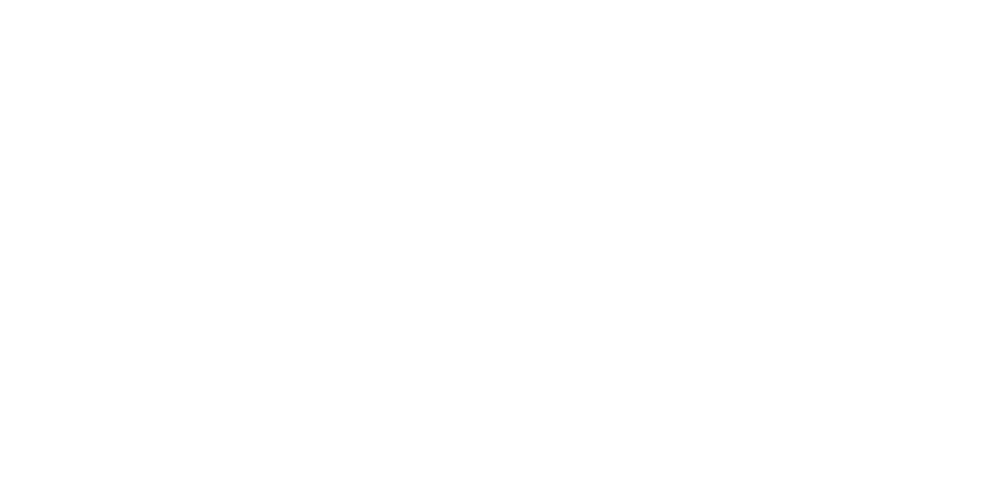

<div align=center>


</div>

<h2 align=center>About</h2>

An htmx-like framework made for projects who use innovate designs.

I Made Lunar for create awesome designs using a simple framework that i made.

<h2 align=center>Installation</h2>

```powershell
bun add lunardesign

# or

npm install lunardesign
```
